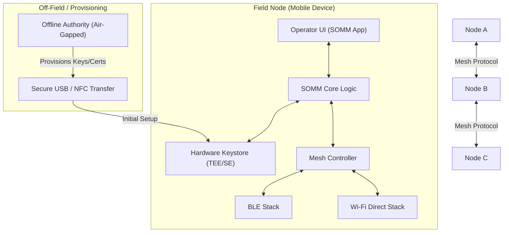

# SOMM High-Level Architecture

## Overview
The SOMM system follows a decentralized mesh architecture where each node is peer-to-peer. There is no central server in the field. Provisioning is handled by an off-field Authority.

## Component Diagram

## Key Components

### 1. Offline Authority
- Acts as the Root of Trust.
- Issues identity certificates for devices.
- Distributes updated Revocation Lists (CRL/Manifest) via physical media.

### 2. SOMM Core Logic
- Handles the **Noise XX Handshake**.
- Manages ephemeral session keys.
- Encapsulates messages into protocol frames.

### 3. Mesh Controller
- Implements store-and-forward logic.
- Maintains a routing table (or gossip-based flood routing).
- Handles fragmentation and reassembly of large messages over BLE.

### 4. Hardware Keystore (TEE/SE)
- Stores the device's long-term private identity key ($SK_{id}$).
- Performs signing operations without exposing the key to the main OS.
- Supports remote attestation to ensure device integrity.

## Interaction Flow: Handshake
1. **Node A** broadcasts a "Hello" packet (Noise XX Message 1).
2. **Node B** responds with Noise XX Message 2 + Certificate.
3. **Node A** verifies Certificate and sends Noise XX Message 3 + Certificate.
4. **Session Key** is established; all subsequent traffic is ChaCha20-Poly1305 encrypted.
